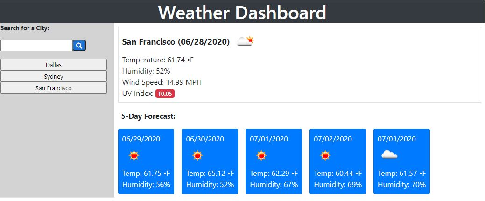

# Weather Dashboard

## Purpose
As an frequent traveler with a busy schedule, I have created a weather dashboard that will allow me to search the weather conditions for upcoming trips, and be able to plan attire and events, accordingly. 

## Features
This weather dashboard shows the current day's weather as well as the upcoming five-day forecast. Upon entering the desired city into the search bar, the user is easily able to see an icon representation of weather conditions, the temperature, the humidity, the wind speed, and the UV index. Icons of weather conditions help the user easily interpret the weather conditions at a glance. Each city search is stored to be able to be used for future searches, in which the user simply has to click the city button to regenerate the information!

## Built With
* HTML
* CSS
* JavaScript
* Bootstrap
* Web APIs
* Server-Side APIs (Open Weather Map.org - source: https://openweathermap.org/)

## Website
https://jennifermulder.github.io/fair-weather/

## Project Status
This weather dashboard is compliant with defined acceptance criteria

## Contribution
Created by Jennifer Mulder